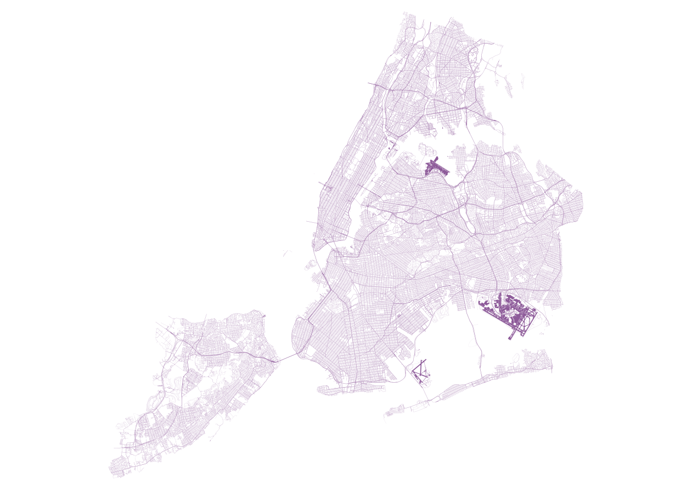
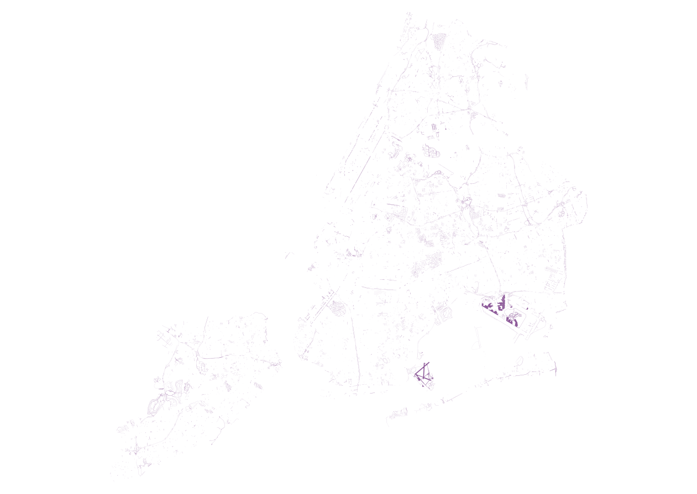

# almost-everywhere

## Data prep

### Reprojection

The 311 data should be [reprojected](https://www.nceas.ucsb.edu/scicomp/recipes/gdal-reproject) to EPSG:2263 to match Planimetrics (you could also do the reverse but Planimetrics is multiple tables and a more complicated format).

You can do this ahead of time:

```bash
ogr2ogr -t_srs EPSG:2263 311_Service_Requests_from_2010_to_Present_2263.csv 311_Service_Requests_from_2010_to_Present.csv
```

Or wait to do it with PostGIS using `ST_Transform`.

### Cut away most 311 columns

For spatial analysis we really only need three columns: `unique_key`, `latitude`, and `longitude` (a.k.a. columns 1, 39 and 40):

```bash
csvcut -c 1,39,40 311_Service_Requests_from_2010_to_Present_2263.csv > slim311.csv
```


## PostgreSQL + PostGIS

### Installation

Follow [PostgreSQL and PostGIS Installation in MacOS](https://medium.com/@Umesh_Kafle/postgresql-and-postgis-installation-in-mac-os-87fa98a6814d)

### Import data


#### 311

Create a table with the proper schema:

```sql
CREATE TABLE service_requests;

ALTER TABLE service_requests ADD COLUMN unique_key VARCHAR(8);
ALTER TABLE service_requests ADD COLUMN latitude NUMERIC;
ALTER TABLE service_requests ADD COLUMN longitude NUMERIC;
```

Copy in the cut csv [[source](https://dataschool.com/learn-sql/importing-data-from-csv-in-postgresql/)]:

```sql
COPY service_requests FROM '/Users/abe.rubenstein/Downloads/slim311.csv' DELIMITER ',' CSV HEADER;
```

Add new geometry column [[source](https://medium.com/@paylakatel/part-2-postgis-at-the-city-of-boston-711cf30cf1f3)]:

```sql
SELECT AddGeometryColumn ('public', 'service_requests', 'the_geom', 4326, 'POINT', 2);

UPDATE service_requests SET the_geom = ST_SetSRID(
  ST_MakePoint(
    "longitude"::double precision,
    "latitude"::double precision
  ),
  4326 # this SRID depends on whether or not you initially reprojected 
);
```

**If you still need to reproject, add a new column to hold EPSG:2263 geometry and fill it.**

```sql
SELECT AddGeometryColumn ('public', 'service_requests','the_geom_2263',2263,'POINT',2);

UPDATE service_requests SET the_geom_2263 = ST_Transform(the_geom, 2263);
```

#### Planimetrics

Copy the FileGDB into Postgres [[source](https://gis.stackexchange.com/a/83325/52312)]. This will create several tables within the specified db.

```bash
ogr2ogr -f PostgreSQL PG:"host=localhost port=5432 dbname=<YOUR_DB_NAME> user=<YOUR_USER>" NYC_DoITT_Planimetric_OpenData.gdb -overwrite -progress -skipfailures --config PG_USE_COPY YES
```

> `-skipfailures` is necessary because some shapes in the FileGDB seem to be misclassified. This happens in QGIS as well.

### Analysis

- [PostGIS Performance tips](https://postgis.net/docs/performance_tips.html)
- [More PostgreSQL perf](https://www.cybertec-postgresql.com/en/postgresql-parallel-create-index-for-better-performance/)
- [Dump query to output file (`.csv`)](https://www.postgresql.org/message-id/15392.46537.511719.871128%40elsick.csl.co.uk)
- [Create spatial index on a table](https://postgis.net/workshops/postgis-intro/indexing.html) (I did this for both tables in query below)
- [Refresher on joins](https://www.codeproject.com/Articles/33052/Visual-Representation-of-SQL-Joins)


Here is the process for `roadbed` [[source](https://gis.stackexchange.com/a/284910/52312)], [[source](https://www.codeproject.com/Articles/33052/Visual-Representation-of-SQL-Joins)]:

```sql
# create hits_ table
# this takes time to run

CREATE TABLE hits_roadbed AS (
  SELECT DISTINCT(objectid) FROM (SELECT * FROM roadbed) AS features
  JOIN service_requests AS points ON ST_Contains(features.shape, points.the_geom_2263)
);

# create miss_ table
# this takes almost no time to run

CREATE TABLE miss_roadbed AS (
  SELECT a.objectid, a.shape FROM roadbed a
  LEFT JOIN hits_roadbed b ON a.objectid = b.objectid
  WHERE b.objectid IS NULL
);

# OR DO IT IN ONE FELL SWOOP:

CREATE TABLE miss_roadbed AS (
  SELECT features.* FROM roadbed AS features
  LEFT JOIN service_requests AS points ON ST_Contains(features.shape, points.the_geom_2263)
  WHERE points.the_geom_2263 IS NULL
);
```

All `roadbed` features|`roadbed` "scraps"
-----|-----
|

 Feature type|Total|# Scraps|% removed|Runtime
-----|-----:|-----:|-----:|----:
`service_requests`|22232364|n/a|n/a|n/a
`curb`|211803|n/a|n/a|n/a
`pavement_edge`|178124|n/a|n/a|n/a
`roadbed`|92389|14852|84%|20 sec
`sidewalk`|49426|46935|5%|60 sec
`sidewalk_line`|43722|n/a|n/a|n/a
`parking_lot`|20704|19657|5%|1 sec
`median`|15357|?|%
`swimming_pool`|14395|?|%
`railroad`|14356|?|%
`open_space_no_park`|14043|?|%
`park`|12380|?|%
`railroad_structure`|9910|?|%
`misc_structure_poly`|4562|?|%
`retainingwall`|4078|?|%
`hydro_structure`|2408|?|%
`transport_structure`|2219|?|%
`hydrography`|2216|?|%
`plaza`|1355|1214|10%|2
`shoreline`|489|?|%
`boardwalk`|135|?|%
~`elevation`~|~1403100~|n/a|n/a

SHOULD STILL TRY TO SIMPLIFY GEOMETRIES?


## Misc

### get approx. table row counts:
[[source](https://stackoverflow.com/questions/2596670/how-do-you-find-the-row-count-for-all-your-tables-in-]postgres)

```sql
SELECT 
  nspname AS schemaname,relname,reltuples
FROM pg_class C
LEFT JOIN pg_namespace N ON (N.oid = C.relnamespace)
WHERE 
  nspname NOT IN ('pg_catalog', 'information_schema') AND
  relkind='r' 
ORDER BY reltuples DESC;
```
